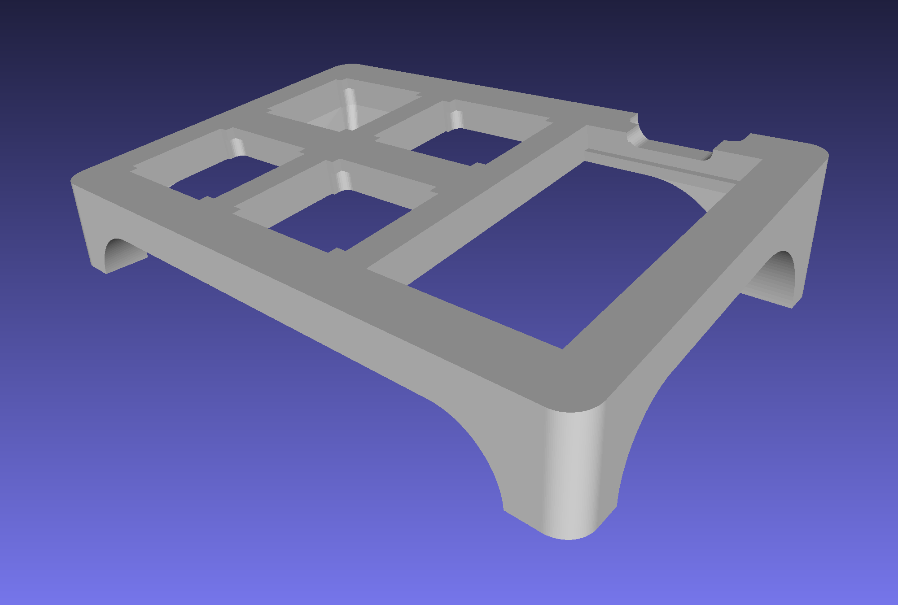
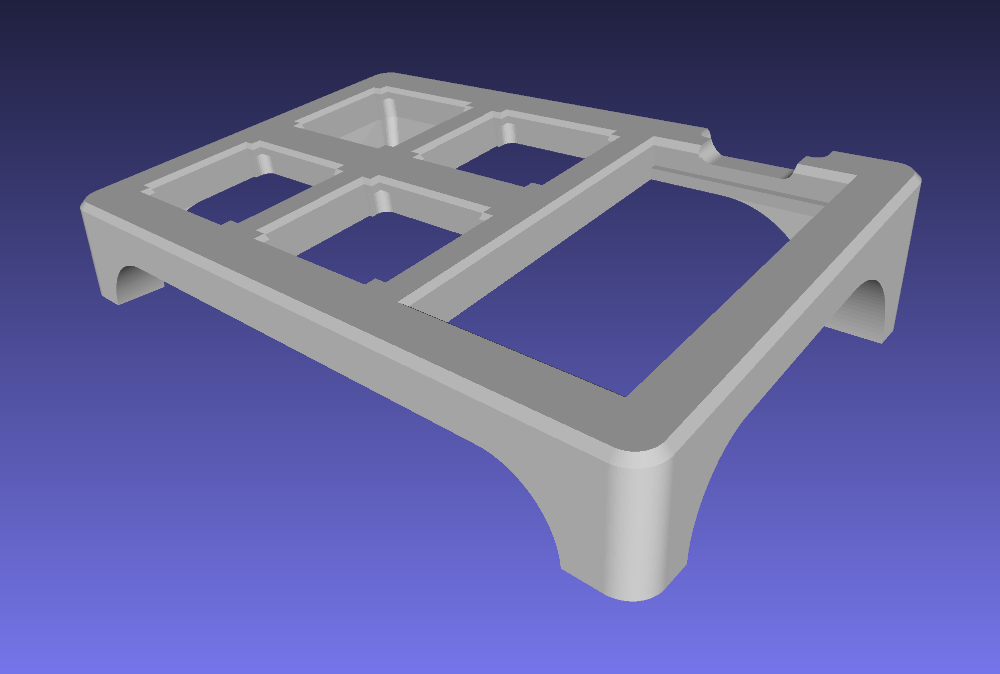

# Makespace Macropad

Un macropad para eseñanza de fabricación, cableado y programación.

## Geometría

El repositorio incluye dos versiones del modelo de la base para su impresión en 3D. Una versión está recta y la otra tiene un lijero bisel sobre los bordes de la cara que está en contacto con la cama de la impresora para que la primera capa no sobresalga.

